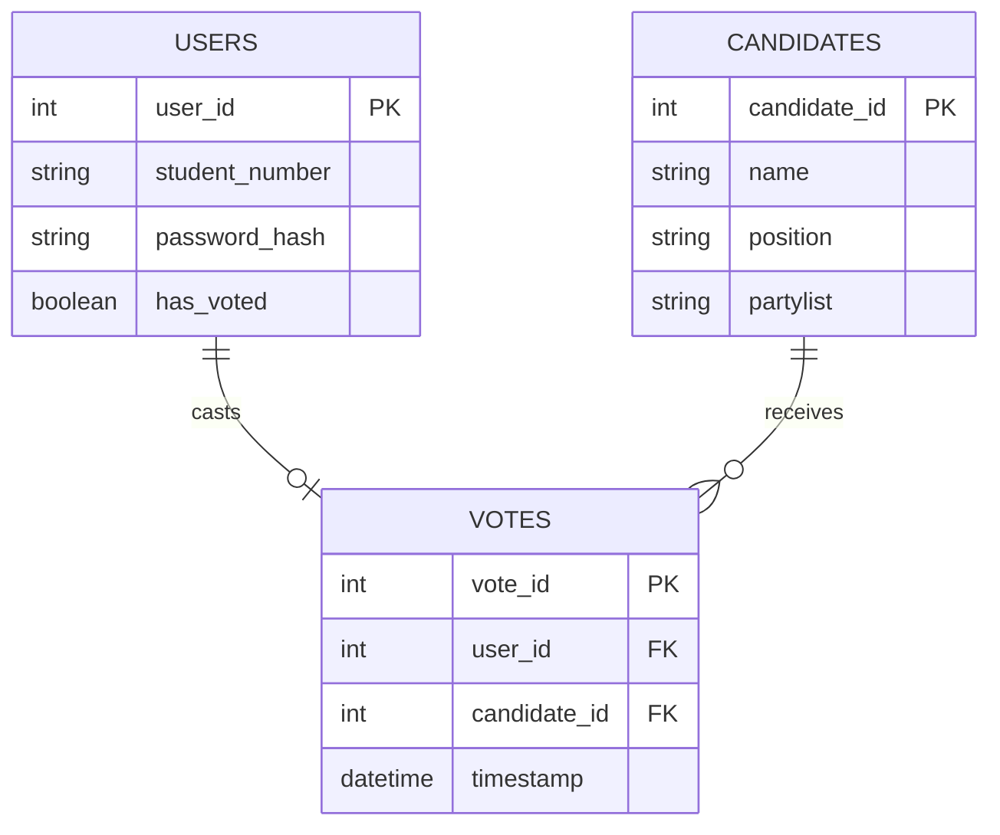
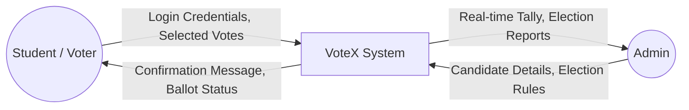
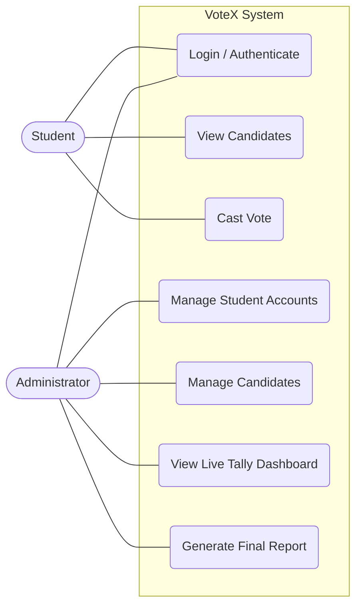

# CHAPTER III DIAGRAMS

You can use these diagrams for Chapter 3 of your documentation. The flowchart diagrams are written using Mermaid.js, which many markdown viewers support, but you can also use snipping tools to screenshot them and paste them into your Word document!

## 1. Development Methodologies (Agile Model)

*Caption: Figure 1 - Agile Development Methodology*

## 2. Database Schema

*Caption: Figure 2 - Database Design*

## 3. System Architecture
```mermaid
flowchart TD
    subgraph Client_Side [Client Side (Frontend)]
        A[Student Device \n Smartphone/Laptop]
        B[Admin Device \n Desktop]
    end
    
    subgraph Server_Side [Server Side (Backend)]
        C[Web API / Server \n React JS Logic & Routing]
    end
    
    subgraph Database_Layer [Database]
        D[(SQL Database)]
    end
    
    A -- "Sends login/votes" --> C
    C -- "Returns ballot/confirmation" --> A
    
    B -- "Configures system" --> C
    C -- "Returns live tally" --> B
    
    C <--> D
```
*Caption: Figure 3 - System Architecture*

## 4. (DFD) Data Flow Diagram Level 0

*Caption: Figure 4 - DFD Level 0*

## 5. UML Use-Case Diagram

*Caption: Figure 5 - Use-case Diagram*

## 6. Wire Frame Design

Below are conceptual AI-generated wireframes you can use as inspiration or insert directly into your document. 

### User (Voter) Page Wireframe

*Caption: Figure 6.1 - Mobile view of the User Voting Page.*

### Admin Dashboard Wireframe

*Caption: Figure 6.2 - Desktop view of the Admin Tally Dashboard.*

### Additional Wireframe Descriptions
If you need to describe other pages in your Word document as requested by the template:
- **Guest/Login**: A minimalist screen featuring the John Paul College logo, a simple welcome message, two input fields (Student ID and Password), and a "Login" button.
- **Customer/Staff**: (If applicable to your project, otherwise you can merge this with Admin/User). Staff pages would look similar to the admin page but with restricted privileges (e.g., they can view the live tally but cannot delete candidates).
